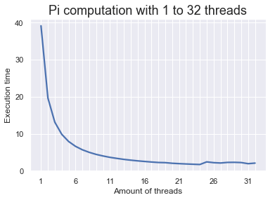

# HPC Tutorial assignment
By Sam Verhezen

## Exercise 1


```python
import seaborn as sns
import matplotlib.pyplot as plt
sns.set()

%matplotlib inline

file1 = "supercomp1.txt"
with open (file1, "r") as f:
    list = []
    for line in f.readlines():
        l = line.strip().split(' ')
        if l[0] not in ["OpenMP", "", "DONE"]:
            list.append(l)

    pis = []
    secs = []
    thrds = []
    for el in list:
        if el[0] == "CPUS:":
            thrds.append(el[2])
        
        else:
            pis.append(el[2])
            secs.append(float(el[-2]))

fig, ax = plt.subplots()

sns.set_context("talk")
plt.plot(thrds,secs)
plt.title("Pi computation with 1 to 32 threads")
plt.xlabel("Amount of threads")
plt.ylabel("Execution time")
every_nth = 5
for n, label in enumerate(ax.xaxis.get_ticklabels()):
    if n % every_nth != 0:
        label.set_visible(False)
plt.show()
```





The execution time is decreases exponentially with an increasing amount of threads. At around 24 threads, the lowest execution time can be noticed. Therefore, it is most efficient for the average node of Cartesius to have 24 threads.

## Exercise 2


```python
file1 = "supercomp2.txt"
with open (file1, "r") as f:
    nums = []
    secs = []
    for line in f.readlines():
        line = line.strip().split(' ')
        secs.append(line[0])
        nums.append(int(float(line[-1])))

fig, ax = plt.subplots()
plt.plot(nums, secs)
plt.title("Pi computation with varying numbers in Leibniz series")
plt.xlabel("Numbers in series")
plt.ylabel("Execution time")
plt.show()
```


